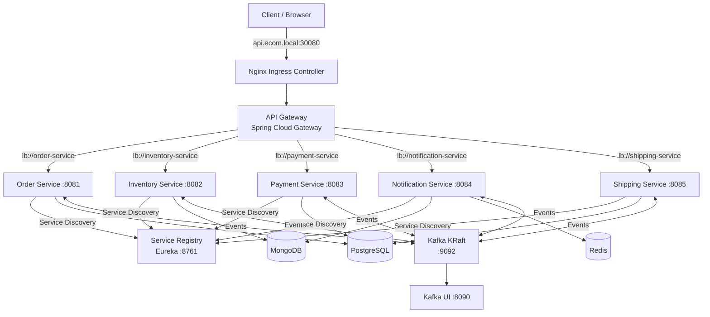

# E-commerce Microservices — Kubernetes & DevOps Deployment


> **Fork** of [hacisimsek/ecommerce-microservices](https://github.com/hacisimsek/ecommerce-microservices)  
> This fork focuses on deploying the application on a bare-metal Kubernetes cluster, applying DevOps and platform engineering practices.

---

## Table of Contents

- [Purpose of this Fork](#purpose-of-this-fork)
- [Infrastructure](#infrastructure)
- [Kubernetes Architecture](#kubernetes-architecture)
- [Issues Resolved](#issues-resolved)
- [K8s Structure](#k8s-structure)
- [Accessing Services](#accessing-services)
- [Deployment](#deployment)
- [Observability](#observability)
- [API Documentation](#api-documentation)

---

## Purpose of this Fork

The original project is a Java/Spring Boot implementation of an e-commerce system using a microservices architecture with the Saga pattern. This fork focuses exclusively on **production deployment on Kubernetes** (bare-metal), covering:

- Writing Kubernetes manifests (Deployment, Service, StatefulSet, Ingress, ConfigMap)
- Networking and Nginx Ingress Controller configuration
- Managing inter-service dependencies (databases, Kafka, Eureka)
- Debugging image compatibility and configuration issues
- Setting up observability tooling (Kafka UI, Swagger, Eureka dashboard)

---

## Infrastructure

| Component | Details |
|---|---|
| Cluster | Kubernetes 1.33 — bare-metal (kubeadm) |
| Node | `pre-prod-1` — 192.168.2.232 |
| Container runtime | containerd |
| Ingress Controller | Nginx (NodePort 30080 / 30443) |
| GitOps | ArgoCD |
| Namespace | `ecom-microservices` |
| Registry | Docker Hub (`otniel217/`) |

---

## Kubernetes Architecture



---

## Issues Resolved

### Kafka — apache/kafka KRaft image with wrong environment variables

The official `apache/kafka:3.7.0` image uses different environment variables than the Bitnami image. The StatefulSet was using `KAFKA_CFG_*` variables (Bitnami) instead of `KAFKA_*` (Apache official), causing the broker to fail with `Missing required configuration zookeeper.connect`.

```yaml
# Before (Bitnami) — caused: Missing required configuration zookeeper.connect
- name: KAFKA_CFG_NODE_ID
  value: "0"

# After (Apache official)
- name: KAFKA_NODE_ID
  value: "0"
- name: KAFKA_PROCESS_ROLES
  value: "broker,controller"
- name: KAFKA_CONTROLLER_QUORUM_VOTERS
  value: "0@kafka-0.kafka:9093"
```

### Spring Boot JPA Autoconfiguration on MongoDB-only services

`inventory-service` and `notification-service` use only MongoDB, but Spring Boot was attempting to autoconfigure JPA/Hibernate, causing a `CrashLoopBackOff` with `Failed to configure a DataSource`.

```yaml
spring:
  autoconfigure:
    exclude:
      - org.springframework.boot.autoconfigure.jdbc.DataSourceAutoConfiguration
      - org.springframework.boot.autoconfigure.orm.jpa.HibernateJpaAutoConfiguration
```

### Eureka — Services registering with pod name instead of IP

Services were registering in Eureka using their pod hostname (`order-service-68cb584f-xxx`) instead of their pod IP, making them unresolvable from the gateway. Fixed by adding the following env variable to all deployments:

```bash
kubectl set env deployment/order-service EUREKA_INSTANCE_PREFER_IP_ADDRESS=true
# Applied to all microservices
```

### Ingress 404 — Nginx running as NodePort, not LoadBalancer

The Nginx Ingress Controller is exposed via **NodePort**, not LoadBalancer. Requests to port 80 on the node were intercepted by another process before reaching Nginx. The correct access port is **30080**.

### Swagger — WebMVC dependency incompatible with WebFlux gateway

Spring Cloud Gateway uses the **WebFlux** (reactive) stack. The `springdoc-openapi-starter-webmvc-ui` dependency is incompatible and silently fails. Replaced with:

```xml
<dependency>
    <groupId>org.springdoc</groupId>
    <artifactId>springdoc-openapi-starter-webflux-ui</artifactId>
    <version>2.1.0</version>
</dependency>
```

Also added `spring.main.web-application-type: reactive` in `application.yml` to explicitly enforce WebFlux mode.

---

## K8s Structure

```
k8s/
├── namespace.yaml
├── api-gateway.yaml
├── service-registry.yaml
├── order-service.yaml
├── inventory-service.yaml
├── payment-service.yaml
├── shipping-service.yaml
├── notification-service.yaml
├── kafka-statefulset.yaml
├── kafka-ui.yaml
├── mongodb-statefulset.yaml
├── postgres-statefulset.yaml
├── redis.yaml
└── ingress.yaml
```

---

## Accessing Services

| Service | URL |
|---|---|
| API Gateway | `http://api.ecom.local:30080` |
| Swagger UI | `http://api.ecom.local:30080/swagger-ui.html` |
| Eureka Dashboard | `http://192.168.2.232:8761` |
| Kafka UI | `http://192.168.2.232:8090` |

Add to `/etc/hosts` (or local DNS):
```
192.168.2.232  api.ecom.local
```

---

## Deployment

### Prerequisites

- Kubernetes cluster 1.28+
- `kubectl` configured
- Nginx Ingress Controller installed
- ArgoCD (optional, for GitOps)

### Apply Manifests

```bash
kubectl create namespace ecom-microservices

# Databases
kubectl apply -f k8s/postgres-statefulset.yaml
kubectl apply -f k8s/mongodb-statefulset.yaml
kubectl apply -f k8s/redis.yaml

# Kafka
kubectl apply -f k8s/kafka-statefulset.yaml
kubectl apply -f k8s/kafka-ui.yaml

# Service Registry
kubectl apply -f k8s/service-registry.yaml

# Microservices
kubectl apply -f k8s/order-service.yaml
kubectl apply -f k8s/inventory-service.yaml
kubectl apply -f k8s/payment-service.yaml
kubectl apply -f k8s/shipping-service.yaml
kubectl apply -f k8s/notification-service.yaml

# Gateway & Ingress
kubectl apply -f k8s/api-gateway.yaml
kubectl apply -f k8s/ingress.yaml
```

### Verify pod status

```bash
kubectl get po -n ecom-microservices
kubectl get ingress -n ecom-microservices
```

---

## Observability

### Eureka — Service Discovery dashboard

```bash
kubectl port-forward --address 0.0.0.0 svc/service-registry 8761:8761 -n ecom-microservices
```

### Kafka UI — Topics & Consumer Groups

```bash
kubectl port-forward --address 0.0.0.0 svc/kafka-ui 8090:8080 -n ecom-microservices
```

### Logs

```bash
# Gateway
kubectl logs -f deploy/api-gateway -n ecom-microservices

# Order service
kubectl logs -f deploy/order-service -n ecom-microservices
```

---

## API Documentation

Full API documentation is available via Swagger UI, aggregating all microservices:

```
http://api.ecom.local:30080/swagger-ui.html
```

### Main Endpoints

| Method | Endpoint | Description |
|---|---|---|
| POST | `/api/orders` | Create an order |
| GET | `/api/orders/{id}` | Get order by ID |
| GET | `/api/orders/customer/{customerId}` | Get all orders for a customer |
| POST | `/api/inventory` | Create an inventory item |
| GET | `/api/inventory/check` | Check product availability |
| GET | `/api/payments/order/{orderId}` | Get payment for an order |
| GET | `/api/shipping/order/{orderId}` | Get shipment for an order |
| GET | `/api/notifications/customer/{customerId}` | Get customer notifications |

### Example — Create an order

```bash
curl -X POST http://api.ecom.local:30080/api/orders \
  -H "Content-Type: application/json" \
  -d '{
    "customerId": "3fa85f64-5717-4562-b3fc-2c963f66afa6",
    "items": [
      {
        "productId": "3fa85f64-5717-4562-b3fc-2c963f66afa6",
        "productName": "Smartphone",
        "quantity": 1,
        "price": 799.99
      }
    ]
  }'
```

---

*Fork maintained by otniel217 — Kubernetes & DevOps Deployment*